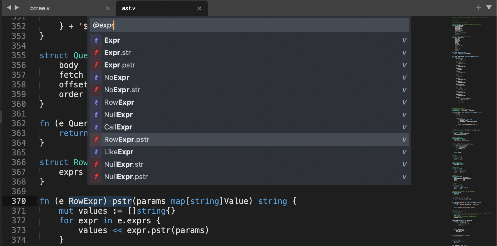

# Sublime Text Support for the V Programming Language

This bundle provides [V](https://vlang.io/) syntax highlighting for Sublime
Text.

## Installation

You can install the [V](https://packagecontrol.io/packages/V) package with
[Package Control](https://packagecontrol.io):


For code completion you can
[install vlang/vls for Sublime Text 3 or 4](https://github.com/vlang/vls#sublime-text-3-and-4).

## Features

Commands for building, running, testing, formatting and updating V itself:


Inline errors and warnings:


Quickly goto to any symbol:



## Command Palette

Any commands that generate output will show in a new window called "V". You may
leave this tab open an any future runs will be appended.

### V: Build

Build the current module (directory).

### V: Build File

Build the current file.

### V: Format File

Format the current file.

### V: Format Module

Format the current module.

### V: Format Project

Format the current project.

### V: Run

Execute `v run` on the current module (directory).

### V: Run Test

Execute `v run` only on the current file.

### V: Test

Execute `v test` only on the current module (directory).

### V: Test File

Execute `v test` only on the current file.

### V: Update

Update V to the latest version (`v up`).

## Custom Commands

```json
{
    "caption": "Build Prod",
    "command": "v",
    "args": {
        "cmd": "-prod ${module}",   // required (string)
        "output": true,             // optional (boolean)
    }
},
```

- `cmd` is required and in the example above will construct and execute
`v -prod "some/folder/path"`.
- `output` is optional (defaults to `true`). If `false`, the output is not shown
in the "V" window. This is useful for commands you intend to be silent (such as
`v fmt`).

See
[Sublime Variables](https://www.sublimetext.com/docs/build_systems.html#variables)
for full list, but some common ones are:

- `${file}` for the current file path.
- `${file_path}` for the directory the current file exists in (the module).
- `${folder}` for the project directory.

## Contributing

Note: Make sure you uninstall the package if it's already installed with
"Package Control > Remove Package..."

Now clone the package locally:

```sh
cd ~/Library/Application\ Support/Sublime\ Text/Packages
git clone https://github.com/elliotchance/vlang-sublime.git
```
